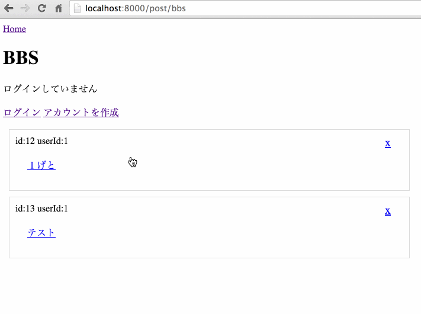

This is BBS using Go Lang

using [goose](https://bitbucket.org/liamstask/goose) for migration


## Preview

##### Functions
- Create User
- Login.
- Post, Update, Delete the text.



### How To set Up 

type below to apply all available migrations

```
goose up
```

to run go server

```
go run main.go
```

and will appear on the console `Starting Goji on [::]:8000`

So you can use Go BBS to access below URL

```
localhost:8000
```


